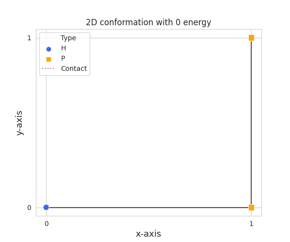
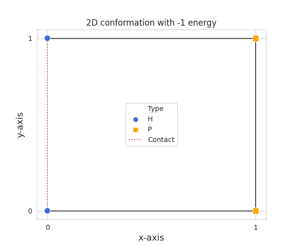

.. Quickstart for using Prospr for the first time.

Quickstart
==========
One can choose to use the Python package, or only the C++ core. The C++ core is
handy for maximizing the execution speed of your experiments, while the Python
package may lower development time and offers more functionality.

Example usage is given using the Python package and only shows basic usage.
Please refer to the :doc:`api` to see the equivalent usage in C++ and all
functionality.

Please take a look at the :doc:`installation` page first to see how Prospr can
be installed.

Creating Proteins
-----------------
After installing Prospr, creating Protein objects is quite easy. A Protein
object can be seen as a space manager for AminoAcid objects. The AminoAcid
objects store the internal linkage, their index in the protein sequence, and
their type. When generating a Protein object, the required AminoAcid objects
are created and linked automatically as well.

One can simply create an HP-model Protein object as follows:

.. code-block:: python

    from prospr import Protein

    p_2d = Protein("HPPHPPH")
    p_3d = Protein("HPPHPPH", dim=3)
    p_4d = Protein("HPPHPPH", dim=4)
    p_5d = Protein("HPPHPPH", dim=5)
    ...

where *dim* is the dimension to fold in.

The *model* parameter allows for selecting different models in the future.
So far, only the HP and HPXN models are supported. You can create a HPXN-model
protein as follows:

.. code-block:: python

    from prospr import Protein

    p_2d_hpxn = Protein("HPNPPNH", model="HPXN")
    ...

Custom models are also possible by providing a dictionary mapping the possible
ways to bond. The dictionary should map strings to integers, where the strings
are two characters identifying the amino acid types that can bond, and the
integer the stability value of that bond. As an example, this is a redefinition
of the HPXN-model:

.. code-block:: python

    from prospr import Protein

    bond_values = {"HH": -4, "PP": -1, "PN": -1, "NN": 1}
    p_2d_HP = Protein("HPNPPNH", dim=2, bond_values=bond_values)

Note that the inverse of the bonds (e.g. *NP* from the *PN* bond) are added
automatically. If you **do not** want this, disable *bond_symmetry* through the
parameter:

.. code-block:: python

    from prospr import Protein

    bond_values = {"HH": -4, "PP": -1, "PN": -1, "NN": 1}
    p_2d_HP = Protein("HPNPPNH", dim=2, bond_values=bond_values, bond_symmetry=False)

Protein attributes
------------------
A Protein object keeps track of multiple properties while it is being folded.
These properties can be checked as attributes of the Protein object. All
properties are listed below and speak for themselves, but please refer to the
:doc:`api` to see their exact descriptions.

.. code-block:: python

    from prospr import Protein

    p_2d = Protein("HPPH")

    p_2d.sequence
    >>> "HPPH"

    p_2d.cur_len
    >>> 0

    p_2d.dim
    >>> 2

    p_2d.last_move
    >>> 0

    p_2d.last_pos
    >>> [0, 0]

    p_2d.score
    >>> 0

    p_2d.solutions_checked
    >>> 0

    p_2d.aminos_placed
    >>> 1

    p_2d.bond_values
    >>> {"HH": -1}

    p_2d.max_weights
    >>> [-1, 0, 0, -1]

Placing amino acids
-------------------
A Protein object is generated with the first amino acid fixed at the origin.
One can place the next amino acid via the *.place_amino(move)* function.
This function takes a move as an argument, which is a number representing the
axis to move over. As an example, 1 can be seen as the x-axis, 2 as the y-axis,
etc. Negative numbers represent movement in negative direction.

.. code-block:: python

    ...
    p_2d.place_amino(1)
    p_2d.place_amino(2)
    p_2d.place_amino(-1)

Removing amino acids
--------------------
Amino acids can be removed via the *.remove_amino()* function.

.. code-block:: python

    ...
    p_2d.remove_amino() # Leaving the previous moves [1, 2]
    p_2d.remove_amino() # Leaving the previous move [1]

Validating moves
----------------
Before trying to place an amino acid, it it is recommended to check whether the
move is valid. This can be done via the *.is_valid(move)* function, which takes
the requested move as an argument.

.. code-block:: python

    from prospr import Protein

    p_2d = Protein("HPPH")
    p_2d.is_valid(1)
    >>> True

    p_2d.place_amino(1)
    p_2d.is_valid(-1)
    >>> False

Placement information
---------------------
While writing algorithms, it might be necessary to check what amino acid is
placed at a specific spot, or where the previous and next ones are placed. This
can be checked via the *.get_amino(position)* function, which takes a list of
integers representing the requested position as an argument. It returns an
AminoAcid object, which has its *type*, *index*, *prev_move*, and *next_move*
as attributes.

.. code-block:: python

    from prospr import Protein

    p_2d = Protein("HPPH")
    p_2d.place_amino(1)
    p_2d.place_amino(2)
    amino = p_2d.get_amino([1, 0])

    amino.type
    >>> "H"

    amino.index
    >>> 1

    amino.prev_move
    >>> -1

    amino.next_move
    >>> 2

It might also occur that you want to check if an amino acid at a specific index
can create bonds. This can be checked via the *.is_weighted(index)* function,
which takes the index of the requested amino acid as an argument.

.. code-block:: python

    from prospr import Protein

    p_2d = Protein("HPPH")
    p_2d.is_weighted(0)
    >>> True

    p_2d.is_weighted(1)
    >>> False

Checking stability
------------------
The stability of a (partially) folded Protein is tracked in the *.score*
attribute. This attribute changes dynamically when placing and removing amino
acids.

.. code-block:: python

    from prospr import Protein

    p_2d = Protein("HPPH")
    p_2d.place_amino(1)
    p_2d.place_amino(2)
    p_2d.score
    >>> 0

    p_2d.place_amino(-1)
    p_2d.score
    >>> -1

|no_score| |with_score|

Checking number of changes
--------------------------
In order to compare the efficiency of algorithms, a Protein object also keeps
track of the number of moves performed thus far. This does not include the
removal of amino acids. The current number of performed moves is tracked in the
*.changes* attribute.

.. code-block:: python

    from prospr import Protein

    p_2d = Protein("HPPH")
    p_2d.place_amino(1)
    p_2d.changes
    >>> 1

    p_2d.place_amino(2)
    p_2d.remove_amino()
    p_2d.place_amino(-2)
    p_2d.place_amino(-1)
    p_2d.changes
    >>> 4

Hashing folds
-------------
The current fold of a Protein can be generated via the *.hash_fold()* function.
The function will return the sequence of moves for the current conformation.

.. code-block:: python

    from prospr import Protein

    p_2d = Protein("HPPH")
    p_2d.place_amino(1)
    p_2d.hash_fold()
    >>> [1]

    p_2d.place_amino(2)
    p_2d.place_amino(-1)
    p_2d.hash_fold()
    >>> [1, 2, -1]

Setting folds
-------------
At any time, a Protein's conformation can be set to a given set of moves. This
is done via the *.set_hash(fold_hash)* function, which takes a sequence of moves
as an argument, just like the ones generated by the *.hash_fold()* function.

.. code-block:: python

    from prospr import Protein

    p_2d = Protein("HPPH")
    p_2d.place_amino(2)
    p_2d.place_amino(-1)
    p_2d.hash_fold()
    >>> [2, -1]

    p_2d.set_hash([1, 2, -1])
    p_2d.hash_fold()
    >>> [1, 2, -1]

Resetting Proteins
------------------
Sometimes you might want to reset a Protein object. This can be because you want
to reuse the same Protein object, or because you want to clear the conformation.
Each of these scenarios has their own function.

In order to reset the whole Protein object, use the *.reset()* function.

.. code-block:: python

    from prospr import Protein

    p_2d = Protein("HPPH")
    p_2d.place_amino(1)
    p_2d.place_amino(2)
    p_2d.place_amino(-1)
    p_2d.changes
    >>> 3

    p_2d.hash_fold()
    >>> [1, 2, -1]

    p_2d.reset()
    p_2d.changes
    >>> 0

    p_2d.hash_fold()
    >>> []

Use the *.reset_conformation()* function to only reset the placement of the
amino acids. This includes setting the *.score* to 0, as only the amino acid in
the origin remains in place.

.. code-block:: python

    from prospr import Protein

    p_2d = Protein("HPPH")
    p_2d.place_amino(1)
    p_2d.place_amino(2)
    p_2d.place_amino(-1)
    p_2d.changes
    >>> 3

    p_2d.hash_fold()
    >>> [1, 2, -1]

    p_2d.reset_conformation()
    p_2d.changes
    >>> 3

    p_2d.hash_fold()
    >>> []

Built-in algorithms
-------------------
Prospr offers some algorithms for folding Proteins. These are included in the
C++ core, making them time efficient relative to Python alternatives. The
:doc:`api` contain a list of all available built-in algorithms. They can all
be easily used via a direct import, as is shown below.

.. code-block:: python

    from prospr import Protein, depth_first

    p_2d = Protein("HPPH")
    p_2d = depth_first(p_2d)
    p_2d.score
    >>> 1

    p_2d.hash_fold()
    >> [1, 2, -1]

Visualizing conformations
-------------------------
Visualizing conformations can be key to understanding how the resulting
conformation was found. It also helps illustrating your research. Prospr's
Python package has a built-in visualization module so you do not have to write
your own. Visualizing a conformation can easily be done via the *plot_protein()*
function from the *prospr.visualize* module.

.. code-block:: python

    from prospr import Protein
    from prospr.visualize import plot_protein

    p_2d = Protein("HPPH")
    p_2d.place_amino(1)
    p_2d.place_amino(2)
    p_2d.place_amino(-1)
    plot_protein(p_2d)
    >>>

The *plot_protein()* function has a couple parameters to style the figure to
your likings. Most importantly, there are two styles to select: *basic* and
*paper*. The first will show the protein in a clear and zoomed-in way, while
the latter is more compact and fancy. Here you can see the difference between
the two for the same conformation.

.. code-block:: python

    plot_protein(p_2d)
    >>>

    plot_protein(p_2d, style="paper")
    >>>

|basic_fig| |paper_fig|

Besides the style, it is also possible to change the positioning of the legend.
You can turn the legend off through the *legend* parameter, or change its
position to be *inner* or *outer* via the *legend_style* paremeter.

.. code-block:: python

    plot_protein(p_2d, legend_style="inner")
    >>>

    plot_protein(p_2d, legend_style="outer")
    >>>

    plot_protein(p_2d, legend=False)
    >>>

|inner_legend| |outer_legend| |no_legend|

There are also some parameters that alter the style of the figure. Please refer
to the :doc:`api` for a full overview.

Using datasets
--------------
Datasets are valuable for a fair comparison between algorithms. That is why
Prospr's Python package comes with a built-in collection of datasets. Loading a
dataset can easily be done via the available load functions in the
*prospr.datasets* module. Currently, there are three datasets available:
*vanEck250*, *vanEck1000*, and *vanEck_hratio*.

The *vanEck1000* dataset contains 1000 unique proteins for lengths
[10, 15, 20, .., 100], where the chances of sampling a H or P are equal.
*vanEck250* offers a subset of *vanEck1000*, by simply offering the first 250
proteins for each length. *vanEck_hratio* has around 1000 proteins sampled for
each of the H-ratio intervals
{(0.0, 0.1), [0.1, 0.2), [0.2, 0.3), .., [0.9, 1.0)}. You can find their usage
below, as well as in the :doc:`api`.

.. code-block:: python

    from prospr.datasets import load_vanEck250, load_vanEck1000, load_vanEck_hratio

    length_10 = load_vanEck250()
    length_15 = load_vanEck250(15)
    length_20 = load_vanEck250(20)
    len(length_20)
    >>> 250

    length_20 = load_vanEck1000(20)
    len(length_20)
    >>> 1000

    length_25_hratio_01 = load_vanEck_hratio()
    length_10_hratio_04 = load_vanEck_hratio(10, 0.4)
    length_15_hratio_06 = load_vanEck_hratio(length=15, hratio=0.6)
